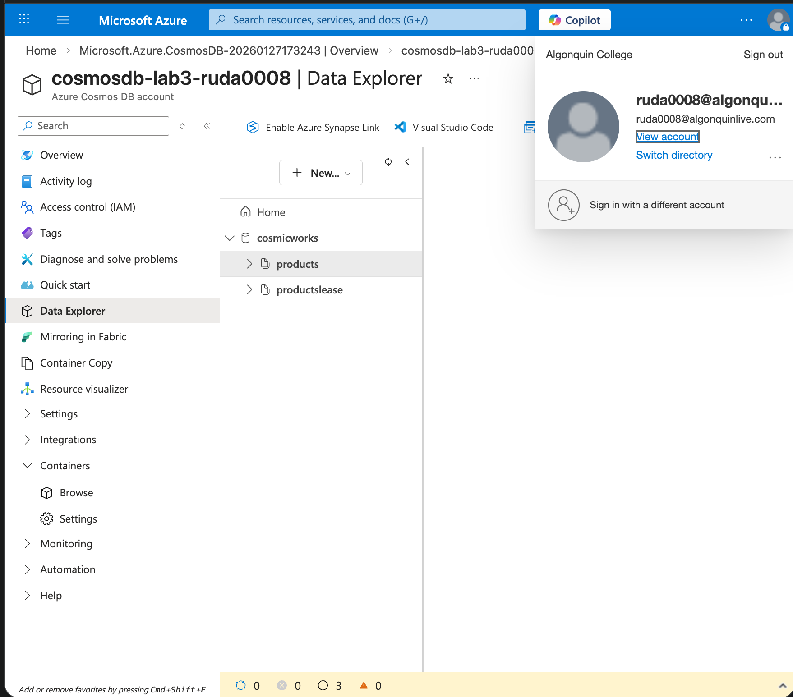
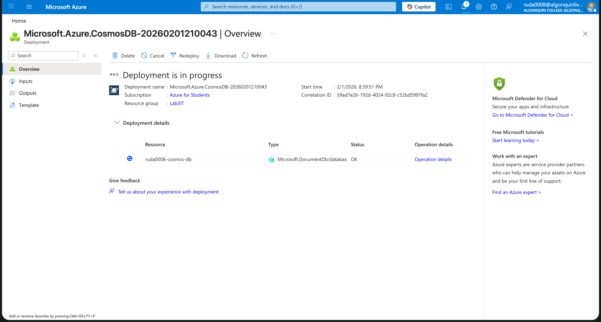
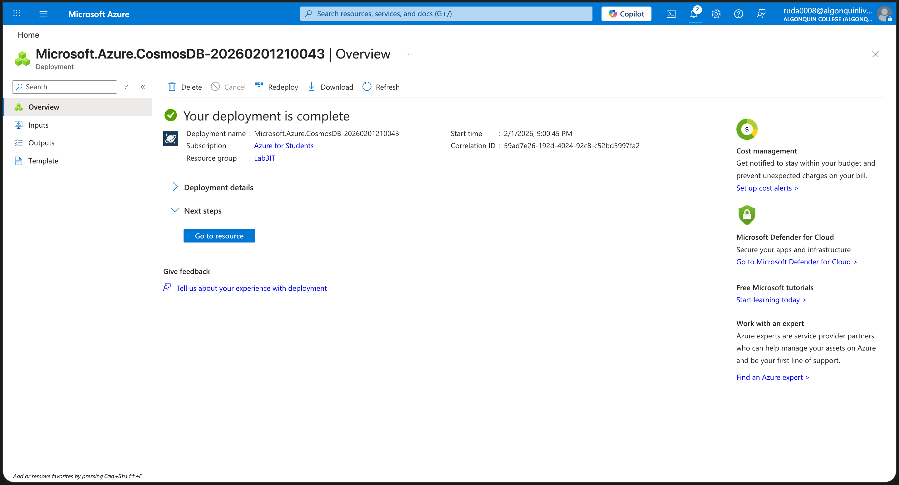
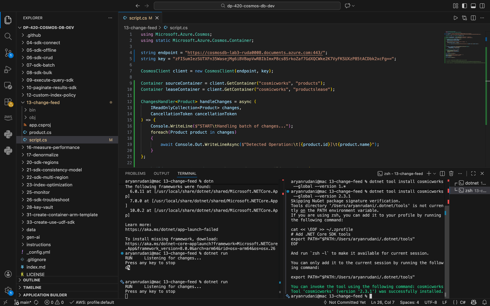
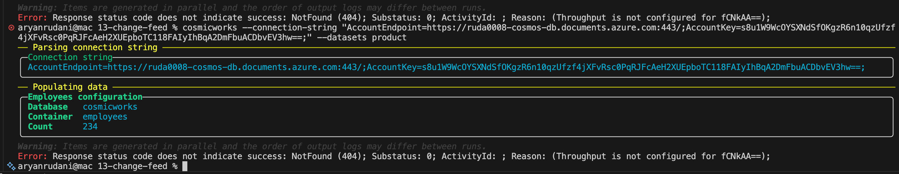
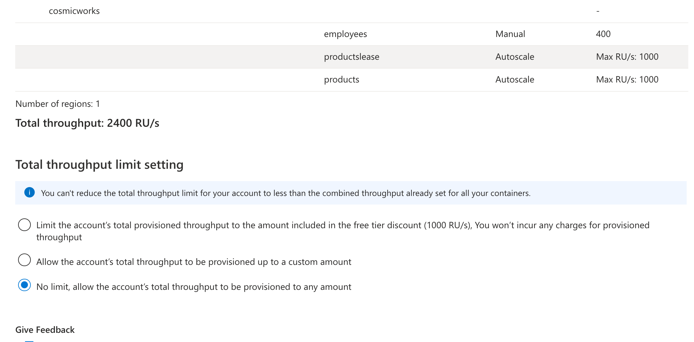

# Name: Aryan Rudani
# Course: CST8921
# Lab NO: 3

<!-- 

 
 -->
# Creating cosmosDB

# Added connection string

### I dont know for some reason i was not able to populate data earlier it was giving me some RBAC problem i fixed that i got another fixed that got this related to throughoutput, i changed the throughoutput to no limit and yet i still encounted the below error. due to these several errors i was not able to complete my lab 

