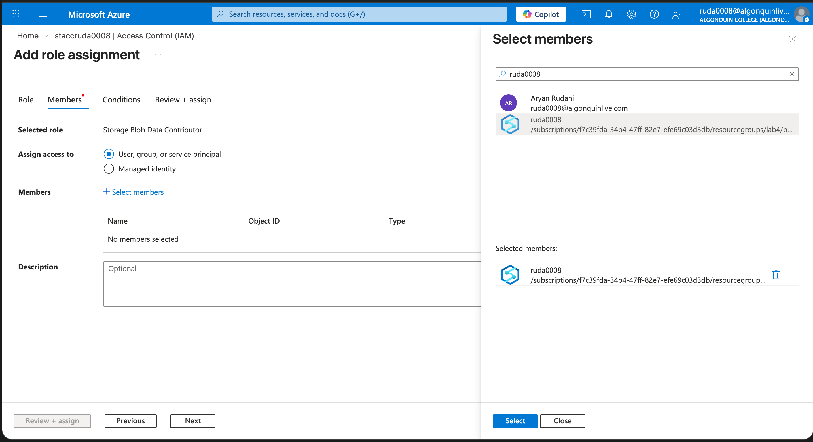
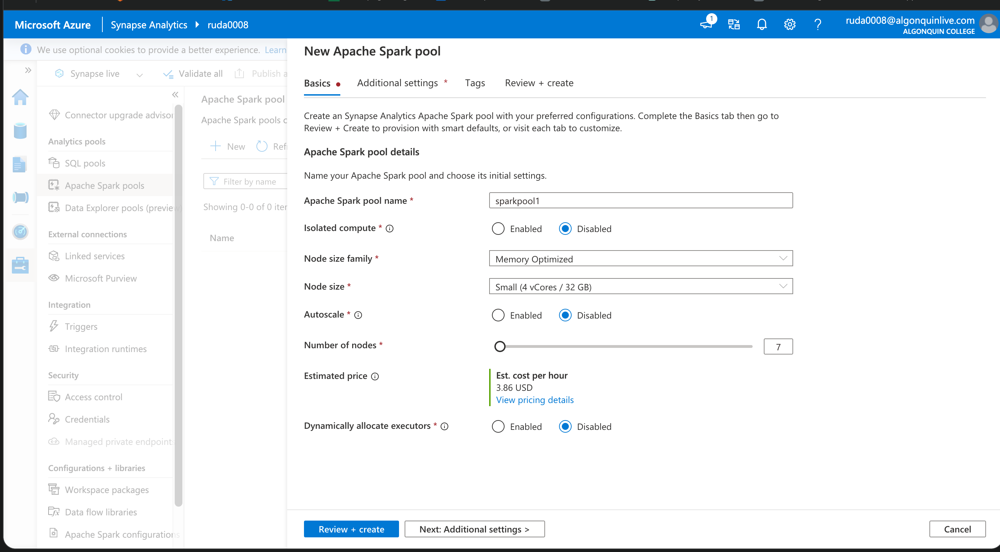

## Creating storage account

## creating Containers

## Creating directories and uploading files in them 

## Creating Azure synapse

## Providing access

## Running tests
 
## Creating Sparkpool

## Failed to run notebook due to quota restrictions

## Trying using Azure data bricks

## creating cluster

## Again ran into issues thus not able to cotinue...

## Tried to do the lab in the `new subscription` but was unable to create synapse......
