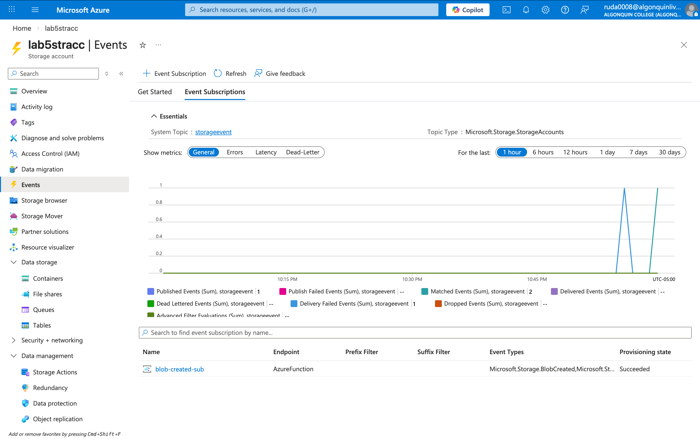

# Name: Aryan Rudani
# Course: CST8921
# Lab NO: 5

## Creating resource group

## Creating Storage account

## Creating Container raw-data

## Creating function (consumption)

## Creating Event Subscription

## Uploading file

## Publish failed
### I tried a lot in different ways as well i tried to deploy resources and entire lab via  azure portal, cli, VS code but all gave me same results sometimes the function itself would not be available and not showup under functions. I would upload the file it would show up in the event subscription but would not trigger the function for some reason! 

